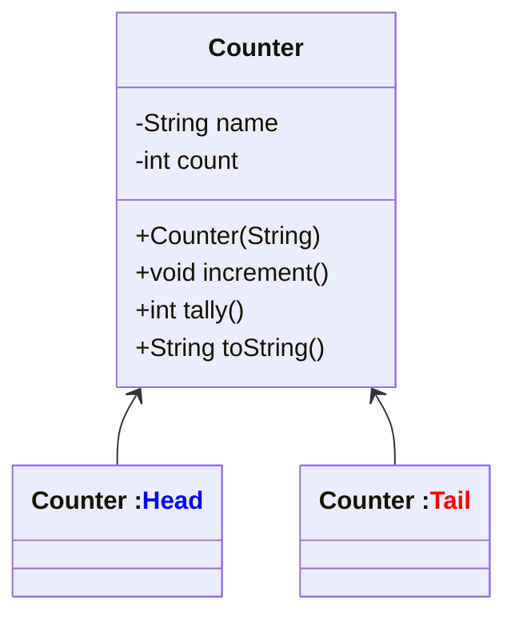

## Programming Assignment - Abstraction
 
 **Question 1.** Write a test class in Java to implement the methods of the following class (**Counter**) to simulate the flipping of coin with two objects namely <font color="blue">Head</font> and <font color="red"> Tail</font>. The program should record and display the number of occurrences of each face over 1000 flips. Save this test file as **Coin.java**.
 <div style="text-align: right"><b>[20 Points]</b></div>





```Java
/*
* File name: Counter.java
* Description: 
*/

public class Counter
{
    private String name;
    private int count;

    public Counter(String id)
    {
        name = id;
    }

    public void increment()
    {
        count++;
    }

    public int tally()
    {
        return count;
    }

    public String toString()
    {
        return count + " " + name;
    }
}
```

**Question 2.** Write a test class named **Dice.java** for the provided program to simulate the rolling of a die. Utilize the concept of an Array of Objects to create six objects, each representing one face of a die. The program should record and display the number of occurrences of each face over 1000 rolls.
<div style="text-align: right"><b>[30 Points]</b></div>

You submission should include the following three files:
- Counter.java
- Coin.java
- Dice.java

Submit your work via the Canvas.
