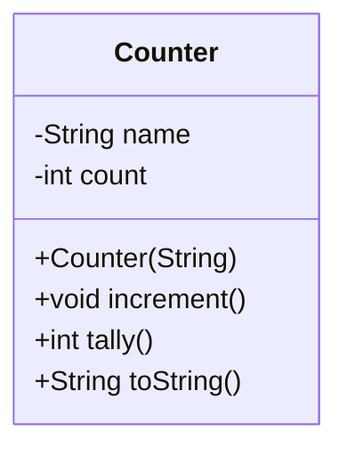

## Programming Assignment - 1 
### Abstraction
 
Write a test class in Java to implement the methods of the following class (**Counter**)




```Java
/*
* File name: Counter.java
* Description: 
*/

public class Counter
{
    private String name;
    private int count;

    public Counter(String id)
    {
        name = id;
    }

    public void increment()
    {
        count++;
    }

    public int tally()
    {
        return count;
    }

    public String toString()
    {
        return count + " " + name;
    }
}
```


