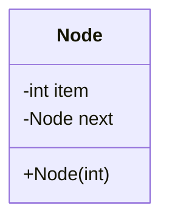
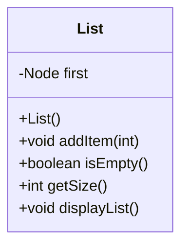

## Programming Assignment - List
 
 ### Question 1 [a]
 Complete the following class (**List.java**) to implement a concept of List. **[30 Points]**



```Java
/*
* File name: Node.java
* Description: 
*/

public class Node
{
    int item;
    Node next;

    Node(int item)
    {
        this.item = item;
        next = null;
    }
}
```


```Java
/*
* File name: List.java
* Description: 
*/

public class List
{
    private Node first;

    public List()
    {
        first = null;
    }

    // The following function adds a new node/item to the list
    public void addItem(int number)
    {
        Node newNode = New Node(number);

        // Complete the rest of the code
    }

    // The following function checks if the list is empty. 
    public boolean isEmpty()
    {
        // Complete the code
    }

    // The following function should return how many items are in the list. 
    public int getSize()
    {
        // Complete the code
    }

    //The following function display the items inside the list.
    public void displayList()
    {
        // Complete the code
    }
}
```

 ### Question 1 [b]
 Write a program(**TestList.java**) to test the correctness of each of the methods/functions of class List (List.java). **[20 Points]**

Your submission should include the following files:
- Node.java
- List.java
- TestList.java

Submit your work via the Canvas.
