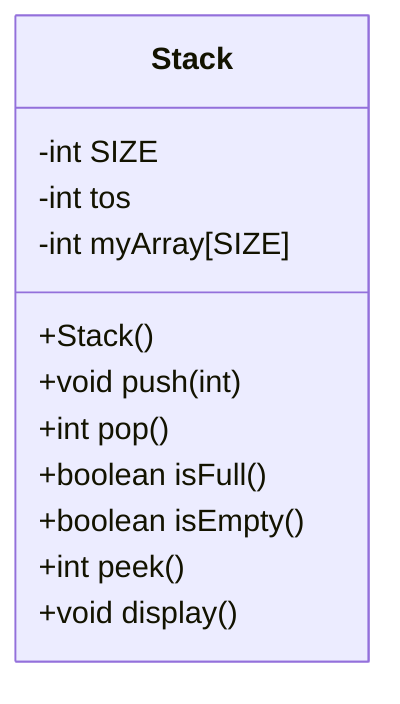

## Programming Assignment - Stack
 
### Question 1
Write a program in Java to implement the concept of STACK (LIFO/FILO) **[25 Points]**



```Java
/*
* File name: Stack.java
* Description: 
*/

public class Stack
{
    int SIZE = 5, tos; // tos - Top Of Stack
    int[] myArray = new int[SIZE];

    public Stack()
    {
        tos = -1;
    }
    
    //Function to add an item to teh stack
    void push(int)
    {
        // Complete the code
    }
    
    //Function to remove the item at the top of the stack
    int pop()
    {
        // Complete the code
    }
    
    //Function to check if teh stack is full (Stack Overflow)
    boolean isFull()
    {
        // Complete the code
    }
    
    //Function to check if the stack is empty (Stack Underflow)
    boolean isEmpty()
    {
        // Complete the code
    }
    
    //Function to return the top item of the stack
    int peek()
    {
        // Complete the code
    }
    
    //Function to display the content of stack
    void display()
    {
        // Complete the code
    }
}
```

Create a test(Test.java) class as follows: **[25 Points]**

- Create an object for the class Stack
- Create a menu for the user to interact with the functions/methods of the Stack class. See example below:
  
```
*****************************
           MENU
*****************************
1: Push Item To Stack
2: Pop Out Item From Stack
3: Peek Top Element Of Stack
4: Display Stack Content
5. Exit Program
*****************************
Enter Your Choice:
```

Your submission should include the following files:
- Stack.java
- Test.java

Submit your work via the Canvas.
