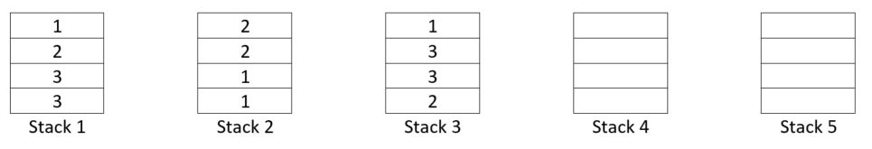

Using the push and pop function of the stack data structure, design a puzzle game to sort the numbers so that three stacks are filled with the same numbers to complete the game. The application should use 5 stacks of capacity four (4), and use four sets of three numbers ([1,1,1,1][2,2,2,2][3,3,3,3]). See the structure below. The program should count the number of moves made to solve the puzzle.

